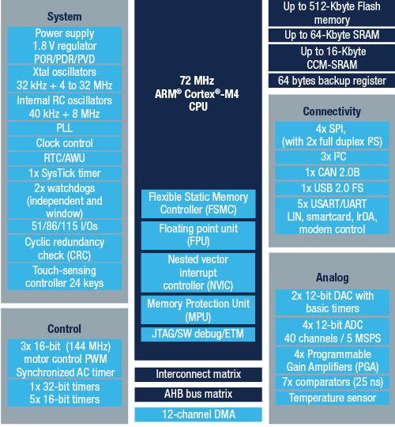

# [STM32F303](https://github.com/SoCXin/STM32F303)

* [ST](https://www.st.com/zh/): [Cortex-M4](https://github.com/SoCXin/Cortex)
* [L3R4](https://github.com/SoCXin/Level): 72 MHz x 1.25 DMIPS/MHz (177CoreMark)

## [简介](https://github.com/SoCXin/STM32F303/wiki)

[STM32F303](https://github.com/SoCXin/STM32F303) 是STM32F30x系列中集成最多功能的器件，最多7个快速和超快速比较器（25 ns）

### 关键特性

* 4xPGA (2.4-3.6V)
* 3x144MHz 电机控制定时器
* 12bit ADC(5MSPS,mix 18MSPS)
* USB + CAN 2.0B

#### 封装规格

* LQFP32 (7×7mm)
* LQFP48 (7×7mm)
* LQFP64 (10×10mm)
* LQFP100 (14×14mm)
* LQFP144 (20×20mm)
* CSP/UFBGA100
* WLCSP49

### [资源收录](https://github.com/SoCXin)

* [参考资源](src/)
* [参考文档](docs/)
* [参考工程](project/)

### [选型建议](https://github.com/SoCXin)

[STM32F303](https://github.com/SoCXin/STM32F303) 该系列的规格型号也是最全的，按封装和存储容量有29个规格配置,兼容系列包括：

* STM32F303，具有高达1MB的Flash、电机控制、USB和CAN
* STM32F105/107，具有以太网MAC、CAN和USB 2.0 OTG

### [探索芯世界 www.SoC.xin](http://www.SoC.Xin)
