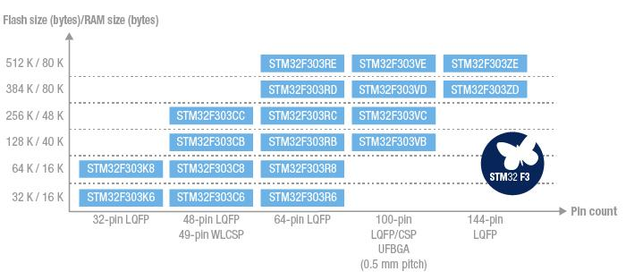

# [STM32F303](https://github.com/sochub/STM32F303) 
 
####  qitas@qitas.cn
#### 父级：[STM32F3](https://github.com/sochub/STM32F3)
#### 归属：[Cortex-M4](https://github.com/sochub/CM4) 
### [芯片简介](https://github.com/sochub/STM32F303/wiki)

STM32 F3系列与STM32 F1系列引脚兼容，扩大了STM32 Cortex-M4系列产品的阵容，现在ST Cortex-M4家族可提供低成本F3系列的和高性能的F4系列。

ARM® Cortex®-M4 core (with FPU and DSP instructions) running at 72 MHz.

STM32 F3系列包括带有64~256KB片上Flash存储器和48KB SRAM的器件，提供的封装选项包括WLCSP66（小于4.3 x 4.3 mm）、LQFP48、LQFP64、LQFP100和UFBGA100。

 

关键参数：

* Up to 7x fast- and ultra-fast comparators (25 ns)
* Up to 4x Op-Amp with programmable gain
* Up to 2x 12-bit DACs
* Up to 4x ultra-fast 12-bit ADCs with 5 MSPS
* Up to 3x fast 144 megahertz motor control timers (resolution < 7 ns)
* Full-speed USB and CAN 2.0B communication interfaces

* operate from 2 to 3.6 Volts.
* packages from 32 to 144 pins.
* Memory  from 32 to 512 Kbytes 

### [资源组成](https://github.com/sochub/STM32F303)

* [参考文档](docs/)
* [参考资源](src/)
* [模板工程](demo/)
* [编译工具](https://github.com/sochub/arm-none-eabi)

### [替换方案](https://github.com/sochub/STM32F303)

* 向下替换方案 [STM32F103](https://github.com/sochub/STM32F103) 
* 向上替换方案 [STM32F407](https://github.com/sochub/STM32F407) 

##  [SoC资源平台](http://www.qitas.cn)

